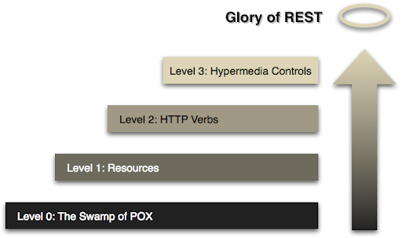

## Spring Boot를 이용한 RESTful Webservice 개발

> 인프런 강의를 듣고 정리한 내용입니다.

### 사용자 목록 조회 API 구현

- UserController -> 실행시 <br>

Autowiring by type from bean name 'userController' via constructor to bean named 'userDaoService'

<br>

### 응답 코드 제어

```java
URI location=ServletUriComponentsBuilder.fromCurrentRequest()
        .path("/{id}")
        .buildAndExpand(savedUser.getId())
        .toUri();
```

response header 에서 Location으로 생성됨

<br>

### 예외처리 핸들링

- 기존 id값이 없는 경우에도 200으로 응답받은 것을 값이 없을 경우 예외처리 해주기

UserNotFoundException을 통해 예외 처리 -> 500에러와 함께 에러 원인이 클라이언트한테 다 보여짐

- // id 값이 없다는 것은 리소스가 존재 x -> 4XX 로 변경<br>
  @ResponseStatus(HttpStatus.NOT_FOUND)


- 예외클래스 일반화 시키기

예외 객체를 생성해주고 CustomizedResponseEntityExceptionHandler를 통해 해당 예외 객체를 반환해주기

<br>

### 유효성 체크 Validation (전처리)

spring boot 2.5.x 인 경우 dependency 추가

```xml
<!-- https://mvnrepository.com/artifact/org.springframework.boot/spring-boot-starter-validation -->
<dependency>
    <groupId>org.springframework.boot</groupId>
    <artifactId>spring-boot-starter-validation</artifactId>
    <version>2.5.5</version>
</dependency>
```

- domain에 컬럼에 유효성 검사 어노테이션 붙여준다.

예외처리를 위해 CustomizedResponseEntityExceptionHandler에서 handleMethodArgumentNotValid 오버라이드 해준다.

<br>

### 다국어처리

```java
// 국제화를 위한 빈등록
@Bean
public LocaleResolver localeResolver(){
        SessionLocaleResolver localeResolver=new SessionLocaleResolver();
        localeResolver.setDefaultLocale(Locale.KOREA);
        return localeResolver;
        }
```

```yml
spring:
  messages:
    basename: messages # 기본 다국어 파일 이름을 messages로 설정 (resources에 생성)
```

<br>

### 응답 데이터 형식 변환 - XML format

```xml

<dependency>
    <groupId>com.fasterxml.jackson.dataformat</groupId>
    <artifactId>jackson-dataformat-xml</artifactId>
</dependency>
```

- 디펜던시 추가 후 postman을 통해 Request-Header에 Accept=application/xml 추가

<br>

### 응답 데이터 제어 - Filtering

- 도메인 클래스가 가지고 있는 중요한 데이터 값이 클라이언트에 노출되면 위험 -> 숨기기 위한 방법

도메인클래스 각 필드에 SpringBoot에서 제공하는 `@JsonIgnore` 사용

-> 클래스 블록에 일괄적으로 처리도 가능 `@JsonIgnoreProperties`

---

- 조금 더 개발지향적으로 코드를 작성해보자

```java
// 전체 사용자 목록 조회
@GetMapping("/users")
public MappingJacksonValue retrieveAllUsers(){
        List<User> users=userDaoService.findAll();

        SimpleBeanPropertyFilter filter=SimpleBeanPropertyFilter.filterOutAllExcept("id","name","joinDate","password");
        FilterProvider filters=new SimpleFilterProvider().addFilter("UserInfo",filter);

        MappingJacksonValue mappingJacksonValue=new MappingJacksonValue(users);
        mappingJacksonValue.setFilters(filters);

        return mappingJacksonValue;
        }
```

<br>

### REST API Version 관리

- URI를 이용한 버전관리
- Request Parameter와 Header를 이용한 버전관리

Request Param을 이용한 방법,

```java
@GetMapping(value = "/users/{id}", params = "version=1")
```

Header값을 이용한 방법,

```java
@GetMapping(value = "/users/{id}", headers = "X-API-VERSION=1")
```

mine타입을 이용한 방법,

```java
@GetMapping(value = "/users/{id}", produces = "application/vnd.company.appv1+json")
```

header에서 Accept=application/vnd.company.appv1+json

<br>

### HATEOAS 적용

> 현재 리소스와 연관된(호출 가능한) 자원 상태 정보를 제공

- Hypermedia As The Engine Of Application State의 약자로, 기본적인 아이디어는<br>
  하이퍼미디어를 애플리케이션의 상태를 관리하기 위한 메커니즘으로 사용한다는 것입니다.



- pom.xml 추가

```xml

<dependency>
    <groupId>org.springframework.boot</groupId>
    <artifactId>spring-boot-starter-hateoas</artifactId>
</dependency>
```

- spring-boot 2.1 이하 버전과 이후 버전이 다르게 구현됨 (주의)

Resource<br>
ControllerLinkBuilder

Resource -> EntityModel<br>
ControllerLinkBuilder -> WebMvcLinkBuilder

```java
// 2.1 이후 버전

import org.springframework.web.bind.annotation.PathVariable;

@GetMapping("/users/{id}")
public EntityModel<User> retrieveUser(@PathVariable Long id){
        ...
        // HATEOAS
        // "all-users", SERVER_PATH + "/users"
        // retieveAllUsers
        EntityModel entityModel=EntityModel.of(user);
        WebMvcLinkBuilder linkTo=linkTo(methodOn(this.getClass()).retrieveAllUsers());
        entityModel.add(linkTo.withRel("all-users"));
        }
```

<br>

### REST API Documentation을 위한 Swagger 사용

- pom.xml 추가

```xml
<!-- https://mvnrepository.com/artifact/io.springfox/springfox-boot-starter -->
<dependency>
    <groupId>io.springfox</groupId>
    <artifactId>springfox-boot-starter</artifactId>
    <version>3.0.0</version>
</dependency>

        <!--<dependency>
          <groupId>io.springfox</groupId>
          <artifactId>springfox-swagger2</artifactId>
          <version>2.9.2</version>
        </dependency>
        <dependency>
        <groupId>io.springfox</groupId>
        <artifactId>springfox-swagger-ui</artifactId>
        <version>2.9.2</version>
        </dependency>-->

```

> 기존 두 개로 의존성 추가했을 경우 HATEOAS와 버전 충돌 오류가 있음. 그래서 starter로 dependency추가

- 구현

```java
import org.springframework.context.annotation.Bean;
import org.springframework.context.annotation.Configuration;
import springfox.documentation.spi.DocumentationType;
import springfox.documentation.spring.web.plugins.Docket;
import springfox.documentation.swagger2.annotations.EnableSwagger2;

@Configuration
@EnableSwagger2
//EnableSwagger
public class SwaggerConfig {

    @Bean
    public Docket api() {
        return new Docket(DocumentationType.SWAGGER_2);
    }
    // Swagger 2
    // ALI the paths
    // All the apis
}
```

> http://localhost:8088/v2/api-docs
> http://localhost:8088/swagger-ui/

<br>

#### Swagger Documentation 커스터마이징

```java
// Swagger 커스터마이징
private static final Contact DEFAULT_CONTACT=new Contact("Kenneth Lee","http://www.jonconsulting.co.kr","qudalsrnt3x@gmail.com");

private static final ApiInfo DEFAULT_API_INFO=new ApiInfo("Awsome API Title","My User management REST API service",
        "1.0","urn:tos",DEFAULT_CONTACT,"Apache 2.0","http://www.apache.org/licenses/LICENSE-2.0",new ArrayList<>());

public static final Set<String> DEFAULT_PRODUCES_AND_CONSUMES=new HashSet<>(Arrays.asList("application/json","application/xml"));

@Bean
public Docket api(){
        return new Docket(DocumentationType.SWAGGER_2)
        .apiInfo(DEFAULT_API_INFO)
        .produces(DEFAULT_PRODUCES_AND_CONSUMES)
        .consumes(DEFAULT_PRODUCES_AND_CONSUMES);
        }
```

<br>

### Actuator를 이용한 api 모니터링

```xml
<!-- https://mvnrepository.com/artifact/org.springframework.boot/spring-boot-starter-actuator -->
<dependency>
    <groupId>org.springframework.boot</groupId>
    <artifactId>spring-boot-starter-actuator</artifactId>
    <version>2.5.5</version>
</dependency>

```

> localhost:8088/actuator

#### 더 많은 정보를 확인하기

```yaml
management:
  endpoints:
    web:
      exposure:
        include: '*'
```

<br>

### HAL Browser 사용하기

- pom.xml 추가

> Hypertext Application Language
> <br> "HAL is a <span style="color: red;">simple format</span> taht gives a
> consistent and easy way to hyperlink between resources in your API."

```xml
//spring-Boot 2.5 버전에서는 hal-explorer로 사용
<dependency>
    <groupId>org.springframework.data</groupId>
    <artifactId>spring-data-rest-hal-explorer</artifactId>
    <version>3.5.1</version>
</dependency>

        <!--
        &lt;!&ndash; https://mvnrepository.com/artifact/org.springframework.data/spring-data-rest-hal-browser &ndash;&gt;
        <dependency>
          <groupId>org.springframework.data</groupId>
          <artifactId>spring-data-rest-hal-browser</artifactId>
        </dependency>
        -->

```

- 장점 HATEOAS 를 사용하기 위해 필요한 리소스를 개별적으로 작업해야했는데 HAL BROWSER를 통해 손쉽게 사용할 수 있음

<br>

### Spring Security

- pom.xml 추가

```xml

<dependency>
    <groupId>org.springframework.boot</groupId>
    <artifactId>spring-boot-starter-security</artifactId>
</dependency> 
```

<br>

### JPA 연습

> Java Persistence API -> ORM 사용

#### 개요

- JPA

자바 ORM 기술에 대한 API 표준 명세 (인터페이스)<br>
EntityManager를 통해 CRUD 처리

- Hibernate

JPA의 구현체, 인터페이스를 직접 구현한 라이브러리<br>
생산성, 유지보수, 비종속성

- Spring Data JPA

Spring Module<br>
JPA를 추상화한 Repository 인터페이스 사용

- pom.xml 추가

```xml

<dependency>
    <groupId>org.springframework.boot</groupId>
    <artifactId>spring-boot-starter-data-jpa</artifactId>
</dependency>

<dependency>
    <groupId>com.h2database</groupId>
    <artifactId>h2</artifactId>
    <scope>runtime</scope>
</dependency>
```

- application.yml 수정
```yaml
spring:
  datasource:
    url: jdbc:h2:mem:testdb
  jpa:
    show-sql: true
    
  h2:
    console:
      enabled: true
```

스프링부트에서 내부적으로 h2콘솔의 데이터소스 정보를 자동으로 생성해주지만
최신 h2버전에서는 데이터베이스를 자동으로 생성하는 것을 방지하도록 설정되어있다.

- DEBUG 모드로 실행 시 콘솔에서 해당 내용 확인 가능
```
H2ConsoleAutoConfiguration matched:
     - @ConditionalOnClass found required class 'org.h2.server.web.WebServlet' (OnClassCondition)
     - found 'session' scope (OnWebApplicationCondition)
     - @ConditionalOnProperty (spring.h2.console.enabled=true) matched (OnPropertyCondition)
```

- data.sql 생성 시 User 테이블 없다고 뜰 때

스프링부트 버전이 올라가면서 하이버네이트와 .sql간의 순번이 바뀜
.sql 우선순위가 높아져서 테이블이 만들어지기 전에 insert하려고해서 에러뜸

해결
```yaml
defer-datasource-initialization: true
```

#### Repository, Controller 생성

> CRUD 작성